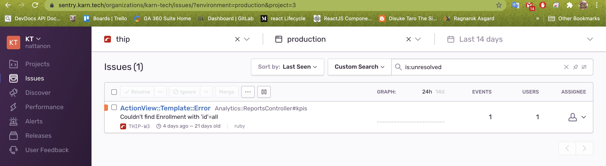

# testing

## Init

```
npm run build
```

### Ex1
``` 
  npm run start1
```

### Ex2
- ใช้โปรเเกรม moniter มี ให้ใช้หลากหลาย เช่น grafana ซึ่งเป็น free version เพื่อให้มารถว่าระบบเราทำงานอยู่ หรือปล่าว
- หรือใช้ sentry เข้ามาช่วยในการ ดู logs ที่มีการ errors จาก user


### Ex3
- combobox และ radio button ในที่นี้คือใช้เป็นการเก็บค่าจากการเลือกเหมือนกัน โดยทั้งเราสามารถทำให้เลือกเเบบหลายค่าได้เช่นกันเเต่ที่นำมาใช้คนละสถานการณ์ คือจำนวนตัวเลือกที่ให้เลือก หากมีนำนวนมากควรใช้ combobox หากมีจำนวนไม่มากควรใช้ radio button เพื่อให้ง่ายจากการเลือก

### Ex4
```
npm run start4
```
i: 5

### Ex5
```
npm run start5
```

r: 2304

