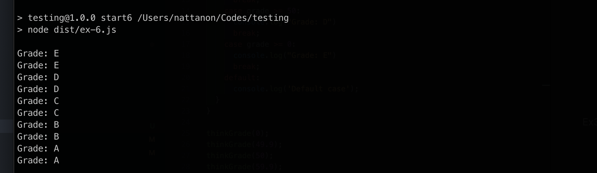
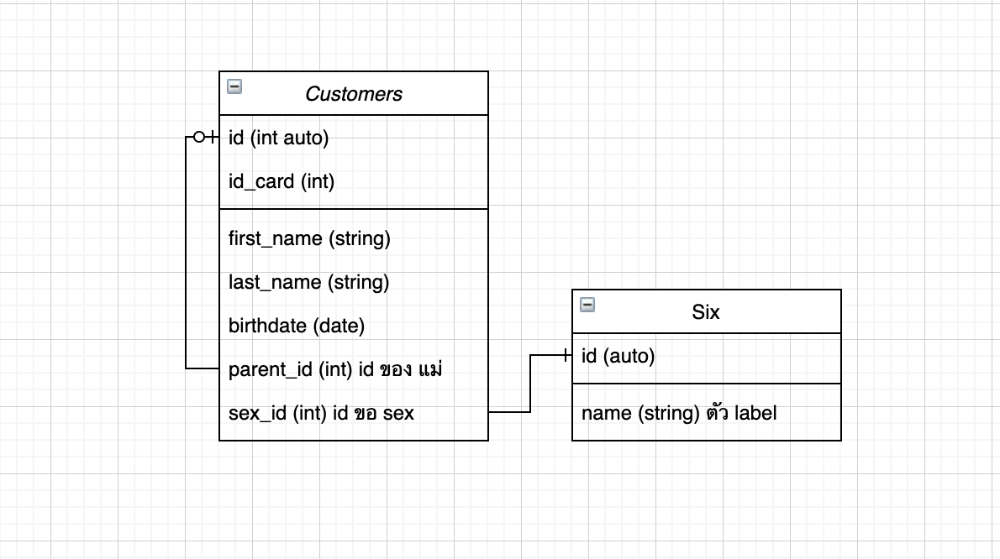
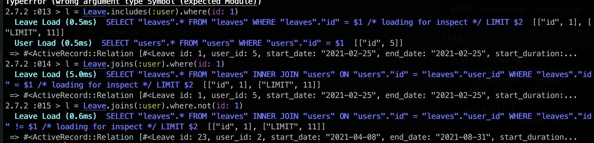

# testing

## Init

```
npm run build
```

### Ex1
``` 
  npm run start1
```

### Ex2
- ใช้โปรเเกรม moniter มี ให้ใช้หลากหลาย เช่น grafana ซึ่งเป็น free version เพื่อให้มารถว่าระบบเราทำงานอยู่ หรือปล่าว
- หรือใช้ sentry เข้ามาช่วยในการ ดู logs ที่มีการ errors จาก user


### Ex3
- combobox และ radio button ในที่นี้คือใช้เป็นการเก็บค่าจากการเลือกเหมือนกัน โดยทั้งเราสามารถทำให้เลือกเเบบหลายค่าได้เช่นกันเเต่ที่นำมาใช้คนละสถานการณ์ คือจำนวนตัวเลือกที่ให้เลือก หากมีนำนวนมากควรใช้ combobox หากมีจำนวนไม่มากควรใช้ radio button เพื่อให้ง่ายจากการเลือก

### Ex4
```
npm run start4
```
i: 5


### Ex5
```
npm run start5
```
r: 2304

### Ex6
```
npm run start6
```


### Ex7



- parent_id คือ id ของลูกค้าหลัก

### Ex8
```sql
 SELECT COUNT(*) FROM "customers" WHERE  (YEAR(NOW()) - YEAR(`birthdate`)) < 30;
```

```sql
 SELECT COUNT(*) FROM "customers" WHERE  (YEAR(NOW()) - YEAR(`birthdate`)) BETWEEN 30 and 29;
```

```sql
 SELECT COUNT(*) FROM "customers" WHERE  (YEAR(NOW()) - YEAR(`birthdate`)) BETWEEN 40 and 49;
```

```sql
 SELECT COUNT(*) FROM "customers" WHERE  (YEAR(NOW()) - YEAR(`birthdate`)) > 50;
```

### Ex9

```sql
 SELECT * FROM "customers"  WHERE "customers"."parent_id" IS NULL;
```
### Ex10

```sql
SELECT "customers".* FROM "customers" INNER JOIN "customers" ON "customers"."id" = "customers"."parent_id" as "prarent" WHERE "customers"."parent_id" = != NULL
```
ก็จะมีเฉพสะลูกค้าย่อย
```sql
WHERE "customers"."parent_id" = != NULL
```

### EX10
```js
class Customers {
  constructor(params) {
  ...
  }
  get all() {
    return this.calcArea();
  }
  insert(params) {
    ...
  }
  edit(params){
    ...
  }
  get(params){
    ...
}
```

